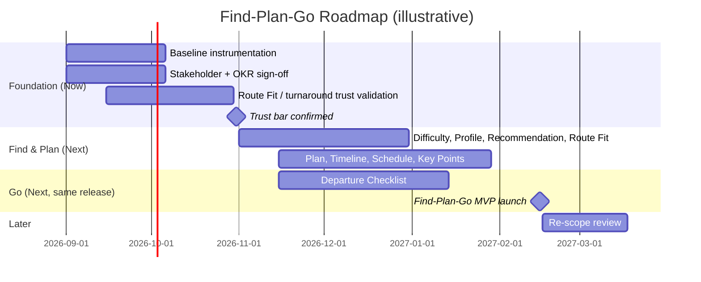

# The Find–Plan–Go Roadmap

**Roadmap Narrative — HikePilot MVP**
Drafted 2026-08-24 · Source: `personalized_hiking_prd_input.md`, `PRD_personalized_hiking_route_planning.zh-TW.md`
Horizon: Now / Next / Later

> No company OKRs, prioritized initiative list, or audience were provided as a brief for this narrative. Themes, sequencing, and dates below are inferred from the PRD's own findings, requirements, and open questions, and are marked *(assumed — confirm)* wherever the source is silent.

## Strategic Context

HikePilot's own research is blunt about where hiking newcomers actually get stuck. It isn't finding a trail — it's judging whether a trail is **right for them**, and then trusting their own call on whether to go. The two lowest-rated moments in the researched journey are comparing a route against yourself and making the final go/no-go decision, and those also happen to be the moments carrying the most safety weight. Find → Plan → Go is built to close that judgment gap end to end — but the source PRD is equally blunt that **none of its success metrics have a baseline yet**, and its OKR alignment, NFR targets, and stakeholder sign-off are all still open. This roadmap treats that candor as the starting constraint, not a footnote.

## Commitment Gradient

| Horizon | What it promises |
|---|---|
| **Now** | Staffed, committed. A promise. |
| **Next** | Our current best plan — not a commitment. |
| **Later** | Direction, not features. |

*Items in Next have moved before and will again.*

---

## Theme 1 — Foundation: Prove the Match Before You Ship It
**Status: Now**

**Strategic rationale:** The PRD's own open questions — no baseline for any success metric, no stated OKR alignment, no NFR targets, no confirmed stakeholder list, no accuracy bar for the LLM-written Route Fit text, and an unvalidated assumption that hikers will actually trust a system-suggested turnaround time — are flagged `[gap]` / `[assumption]` in the source, not resolved. Shipping the full recommendation-to-departure loop on an unmeasured, unvalidated foundation risks building a feature that erodes trust instead of earning it, which is itself one of the PRD's own guardrail metrics.

**Initiatives:**
- Instrument and baseline the three metric families: route-selection success, plan generation & revisit rate, checklist completion
- Confirm strategic alignment / "why now" and sign off the stakeholder list (PM, UX, Eng, Data/AI, a hiking-safety domain expert, Legal/Privacy) — currently all TBD
- Set an accuracy/quality bar for LLM-generated Route Fit text and terrain-tag extraction
- Validate — with a small real-world or wizard-of-oz test — whether hikers actually follow a suggested turnaround time

**Primary metric:** None yet, by design — this theme's deliverable *is* a baseline for every metric in the themes below, plus a stated accuracy bar for Route Fit.

**Dependencies:** None. This is the foundation the rest of the roadmap sits on.

---

## Theme 2 — Find & Plan: The Personalized Route-to-Plan Engine
**Status: Next**

**Strategic rationale:** This is the core of the researched gap. Newcomers can't translate distance and elevation numbers into "can I actually finish this," and they don't want a generic beginner list — they want a route matched to them, with a stated reason. Once Foundation gives us a trust bar to clear, this theme builds the engine that has to clear it: difficulty broken into plain-language dimensions, a saved Hiking Profile, 3–5 personalized recommendations, a Route Fit verdict with hard-limit veto logic, and — once a route is chosen — the plan that turns it into a timeline, schedule, and trailhead logistics.

**Initiatives:**
- Route Difficulty Breakdown · Hiking Profile · Personalized Route Recommendation · Route Fit
- Personalized Hiking Plan · Transportation & Trailhead · Route Timeline
- Suggested Time Schedule · Key Points

**Primary metric:** Recommendation → selection rate, time-to-decision, self-rated confidence, plan-generation rate off selected routes.

**Dependencies:** Foundation's accuracy bar and turnaround-time validation — a Route Fit call that hasn't cleared it is exactly the "felt misleading" guardrail metric this theme is trying to avoid tripping.

---

## Theme 3 — Go: Close the Loop Before Departure
**Status: Next, same release**

**Strategic rationale:** Pre-trip prep is scattered across a dozen inconsistent sources, and the researched friction peaks right at the go/no-go decision. A plan nobody reopens before leaving the house doesn't close that gap. The source PRD frames Find–Plan–Go as one minimal viable *end-to-end* path, not a Find-only or Plan-only product — so Go ships alongside the engine above, not trailing behind it.

**Initiatives:**
- Departure Checklist: map/offline nav, water & supply guidance, gear, live trailhead weather & transit check, share-plan-with-emergency-contact

**Primary metric:** Checklist completion/usage rate; reduction in "left the product to find core planning info elsewhere."

**Dependencies:** Personalized Hiking Plan — the checklist opens from a saved plan.

---

## Why This Order (Causal Progression)

Foundation enables the release after it, concretely: without a baseline, "3–5 recommendations shipped" can't be told apart from "3–5 recommendations that actually helped," and without a validated turnaround-time trust assumption, Suggested Time Schedule is a safety feature nobody's confirmed works. Find & Plan and Go ship together, not in sequence, because the PRD scopes the MVP as one minimal end-to-end path — a route recommendation with no plan behind it, or a plan nobody reopens before departure, is a dead end either way.

## Shape of the Plan

*Illustrative sequencing only — the source PRD sets no dates, so every date below is (assumed — confirm).*

## What's Not on the Roadmap (and Why)

*Direction only. Phrased as problems, not features, so the option space stays open.*

**On-trail live guidance** — Not "real-time GPS navigation." This MVP is pre-trip decision support; live on-trail guidance is a different reliability, battery, and connectivity bar than Find–Plan–Go was built to clear.

**On-trail emergency response** — Not an "SOS button." A safety-critical feature like this needs a liability and reliability bar this MVP hasn't earned yet — and shouldn't borrow trust from a UI that merely looks similar to Route Fit's.

**Hiker community & social features** — The researched gap is individual decision-making under uncertainty, not a social layer. Adding one now would compete for scope with the trust-building work in Now/Next.

**Gear commerce & fitness tracking** — Genuinely useful to hikers, but outside the "should I go, and how" problem this MVP is scoped to solve. Re-entry criteria aren't defined in the source PRD — Product should set them before either returns to a roadmap.

## Executive Summary (shareable)

HikePilot's newest hikers don't struggle to find a trail — they struggle to trust their own judgment about whether it's right for them, and whether to go. We're building Find → Plan → Go to close that judgment gap end to end, but we're proving the match is trustworthy and measurable before we ask anyone to rely on it on an actual mountain. The first release earns baselines and a trust bar; the next ships the full recommendation-to-departure experience together, because a recommendation nobody can act on isn't done. Live on-trail features like navigation and emergency SOS are deliberately not part of this — they need a safety bar this MVP hasn't earned yet.

---

*Source: `personalized_hiking_prd_input.md` · `PRD_personalized_hiking_route_planning.zh-TW.md`*
