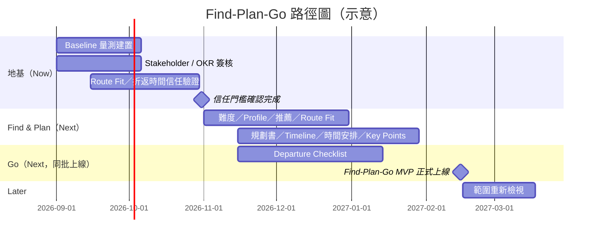

# Find–Plan–Go 產品路徑圖

**Roadmap Narrative — HikePilot MVP**
撰寫日期：2026-08-24 · 來源：`personalized_hiking_prd_input.md`、`PRD_personalized_hiking_route_planning.zh-TW.md`
時間軸架構：Now / Next / Later

> 本次並未提供公司 OKR、已排序的專案清單或目標受眾作為 brief。以下的主題、順序與日期皆推導自 PRD 本身的研究發現、需求與待釐清問題；凡來源文件未明確提及之處，一律標示為 *（假設 — 待確認）*。

## 策略脈絡（Strategic Context）

HikePilot 自身的研究已清楚指出登山新手真正卡關的地方：不是找不到路線，而是無法判斷這條路線「是否適合我」，進而難以信任自己「該不該出發」的決定。在整趟旅程中評分最低的兩個階段，正是「比較路線是否適合自己」與「做出最終出發與否的決策」——而這兩個時刻，恰好也是安全風險最高的時刻。Find → Plan → Go 正是為了完整補上這段判斷落差而設計——但來源 PRD 同樣清楚地指出：**目前所有成功指標皆無 Baseline**，而 OKR 對齊、NFR 目標值與 Stakeholder 簽核也都尚未確定。本路徑圖將這份坦誠視為規劃的起點限制條件，而非附註小字。

## 承諾梯度（Commitment Gradient）

| 時間軸 | 代表的承諾程度 |
|---|---|
| **Now** | 已有人力配置、已承諾執行。等同承諾。 |
| **Next** | 目前最佳規劃——但不是承諾。 |
| **Later** | 方向，而非具體功能。 |

*Next 欄位中的項目過去曾經調整過，未來也仍可能調整。*

---

## 主題一 — 地基：先驗證，才能上線
**狀態：Now**

**策略理由：** PRD 本身列出的待釐清問題——所有成功指標皆無 Baseline、未說明 OKR 對齊、無 NFR 目標值、Stakeholder 名單未確認、LLM 生成的 Route Fit 文字沒有準確度門檻，以及「使用者會信任並遵守系統建議折返時間」這項未經驗證的假設——在來源文件中皆標示為 `[gap]` / `[assumption]`，尚未解決。若在這樣一個未經量測、未經驗證的地基上，直接推出從推薦到出發的完整體驗，很可能推出一個「削弱信任」而非「建立信任」的功能——而這正是 PRD 自己列出的護欄指標之一。

**主要項目：**
- 針對三大指標群組建立量測與 Baseline：路線選定成功率、規劃書產生與回訪率、Checklist 完成率
- 確認策略對齊／「為何是現在」，並完成 Stakeholder 名單簽核（PM、UX、Eng、Data/AI、登山安全領域專家、法務／隱私）——目前皆為 TBD
- 為 LLM 生成的 Route Fit 文字與地形標籤萃取設定準確度／品質門檻
- 透過小規模實地測試或 Wizard-of-Oz 測試，驗證使用者是否真的會遵守系統建議的折返時間

**主要指標：** 尚無——這正是本主題的產出：為下方兩個主題的所有指標建立 Baseline，並為 Route Fit 設定準確度門檻。

**依賴關係：** 無。這是後續整個路徑圖賴以建立的地基。

---

## 主題二 — Find & Plan：個人化路線到規劃書引擎
**狀態：Next**

**策略理由：** 這是研究發現中最核心的落差。新手無法將距離與爬升數字轉換成「我走不走得完」，也不想要一份泛用的新手熱門清單——他們想要的是一條「為我量身推薦、並附上理由」的路線。當地基主題建立起可依循的信任門檻後，本主題便打造必須跨越這道門檻的引擎：將難度拆解成易懂的維度、儲存的 Hiking Profile、3–5 條個人化推薦、附帶硬性條件否決邏輯的 Route Fit 判斷；以及使用者選定路線後，將其轉化為 Timeline、時間安排與登山口資訊的規劃書。

**主要項目：**
- Route Difficulty Breakdown · Hiking Profile · Personalized Route Recommendation · Route Fit
- Personalized Hiking Plan · Transportation & Trailhead · Route Timeline
- Suggested Time Schedule · Key Points

**主要指標：** 推薦→選定路線比例、決策所需時間、使用者自評信心程度、已選路線進一步產生規劃書的比例。

**依賴關係：** 地基主題建立的準確度門檻與折返時間信任驗證——若 Route Fit 判斷未先跨過這道門檻，正是本主題最想避免觸發的「使用者認為說明具誤導性」護欄指標。

---

## 主題三 — Go：出發前完整收尾
**狀態：Next，與主題二同批上線**

**策略理由：** 行前準備資訊分散於十幾種來源、格式不一，而研究中的摩擦點正好集中在最終的出發／不出發決策。若一份規劃書在出發前從未被重新打開，就無法真正補上這段落差。來源 PRD 將 Find–Plan–Go 定義為單一的最小可行「端到端」路徑，而非可拆分的 Find-only 或 Plan-only 產品——因此 Go 必須與上述引擎同批上線，而非延後推出。

**主要項目：**
- Departure Checklist：地圖／離線導航、依路線與天氣建議的水分與補給量、裝備、登山口即時天氣與交通班次確認、與緊急聯絡人分享規劃書

**主要指標：** Checklist 完成率／使用率；「因缺少核心規劃資訊而離開產品到其他平台搜尋」比例的下降。

**依賴關係：** Personalized Hiking Plan——Checklist 需從已保存的規劃書進入。

---

## 為何是這樣的順序（因果推進）

地基主題會具體地為下一階段鋪路：沒有 Baseline，就無法區分「已上線 3–5 條推薦」與「真正發揮效益的 3–5 條推薦」；沒有經過驗證的折返時間信任假設，Suggested Time Schedule 就只是一項尚未被證實有效的安全功能。Find & Plan 與 Go 之所以同批上線而非分階段推出，是因為 PRD 將 MVP 定義為單一的最小可行端到端路徑——只有推薦、沒有規劃書，或是有規劃書卻沒人在出發前重新打開,結果都是死路一條。

## 時程輪廓（Shape of the Plan）

*僅供示意——來源 PRD 未提供任何日期，以下所有日期皆為（假設 — 待確認）。*

## 不在路徑圖上的項目（及其原因）

*僅為方向，非具體功能。以問題描述而非功能名稱呈現，以保留未來的選擇空間。*

**登山途中即時導引** — 並非「即時 GPS 導航」。此 MVP 定位為行前決策輔助，登山途中的即時導引需要完全不同等級的可靠度、電力與訊號連線要求，超出 Find–Plan–Go 目前設計要跨越的門檻。

**登山途中緊急應變** — 並非「SOS 按鈕」。這類安全關鍵功能所需的責任歸屬與可靠度門檻，是此 MVP 尚未達到的；也不應該借用與 Route Fit 外觀相似的介面來取得使用者不該有的信任。

**登山者社群／社交功能** — 研究指出的落差是個人在不確定情況下的決策困難，而非社交層面的需求。此時加入社群功能，會與 Now/Next 中建立信任的核心工作互相搶佔資源。

**裝備商城與體能訓練追蹤** — 對登山者確實有價值，但超出此 MVP 所要解決的「該不該出發、怎麼出發」問題範圍。來源 PRD 未定義重新納入的條件——應由 Product 在任一項目重新排入路徑圖前先行制定。

## 高層摘要（可直接分享）

HikePilot 的新手登山者困擾的不是找不到路線,而是難以信任自己對「這條路線適不適合我」以及「該不該出發」的判斷。我們打造 Find → Plan → Go,是為了完整補上這段判斷落差——但在要求使用者在實際山上依賴這套系統之前,我們得先證明這個配對機制是可信、且可被量測的。第一階段的產出是 Baseline 與信任門檻;下一階段則是將從推薦到出發的完整體驗一次性上線,因為一個使用者無法據以行動的推薦,並不算真正完成。至於即時導航與緊急 SOS 這類登山途中的即時功能,則刻意不在此範圍內——它們需要的安全門檻,是這個 MVP 目前還沒有能力達到的。

---

*來源文件：`personalized_hiking_prd_input.md` · `PRD_personalized_hiking_route_planning.zh-TW.md`*
